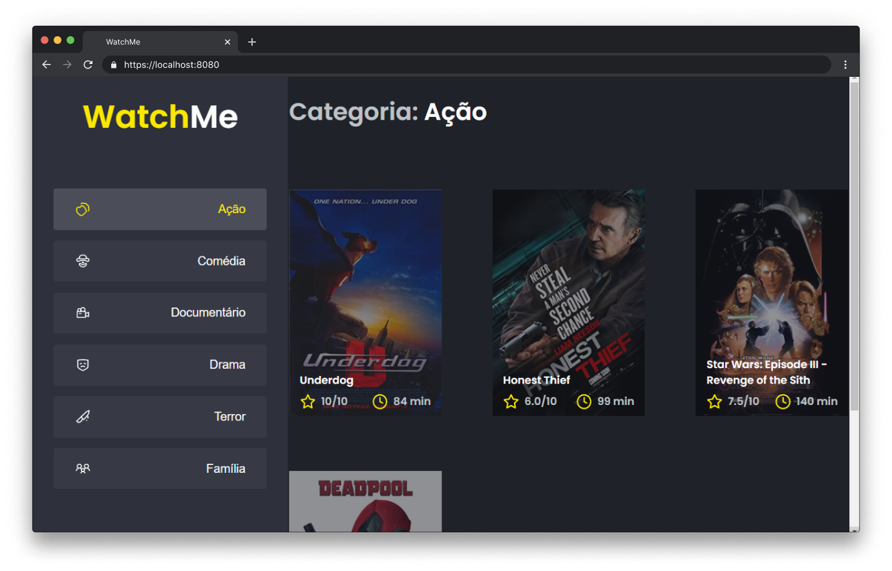

<p align="center">
  
</p>

## 🧪 Tecnologias

Esse projeto foi desenvolvido com as seguintes tecnologias:

- TypeScript
- ReactJS
- SASS
- JSON Server

## 🚀 Uso

```bash
git clone https://github.com/gutemberg-jhonata/watchme.git
cd watchme
yarn server
yarn dev
```

## 💻 Projeto

O WatchMe é um desafio complementar desenvolvido durante o bootcamp Ignite, na trilha de ReactJS. A aplicação tem como objetivo exercitar o conceito de componentização.

## :memo: Licença

Esse projeto está sob a licença MIT. Veja o arquivo [LICENSE](.github/LICENSE.md) para mais detalhes.
